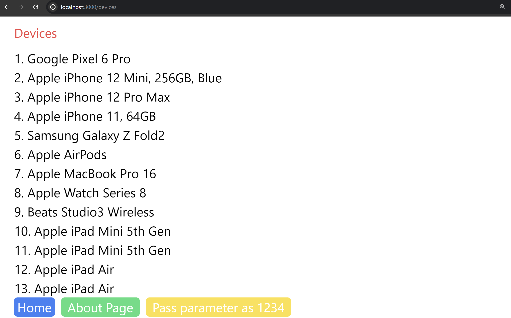
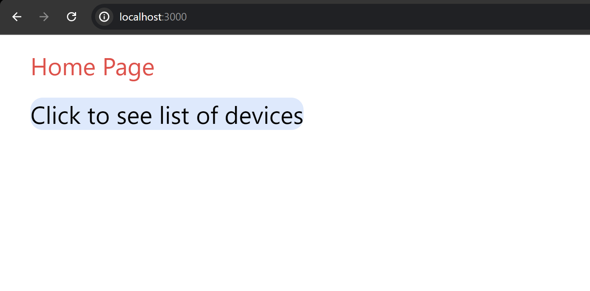
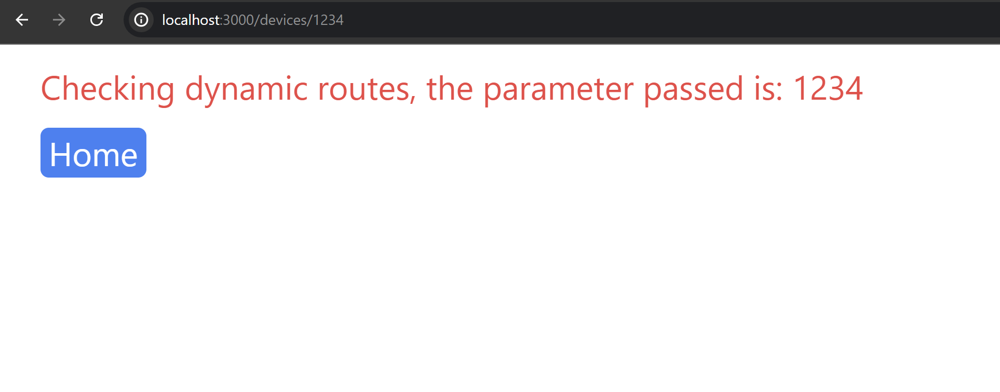

This is a [Next.js](https://nextjs.org/) project bootstrapped with [`create-next-app`]

## Project Snapshots:
  


## Getting Started
First Clone the codebase in your local machine

then enter the project directory and install the node modules ( ensure having node version > 18.17)

```bash
npm install

then, run the development server:

```bash
npm run dev
# or
yarn dev
# or
pnpm dev
# or
bun dev
```

Open [http://localhost:3000](http://localhost:3000) with your browser to see the result.

You can start editing the page by modifying `app/page.tsx`.
how